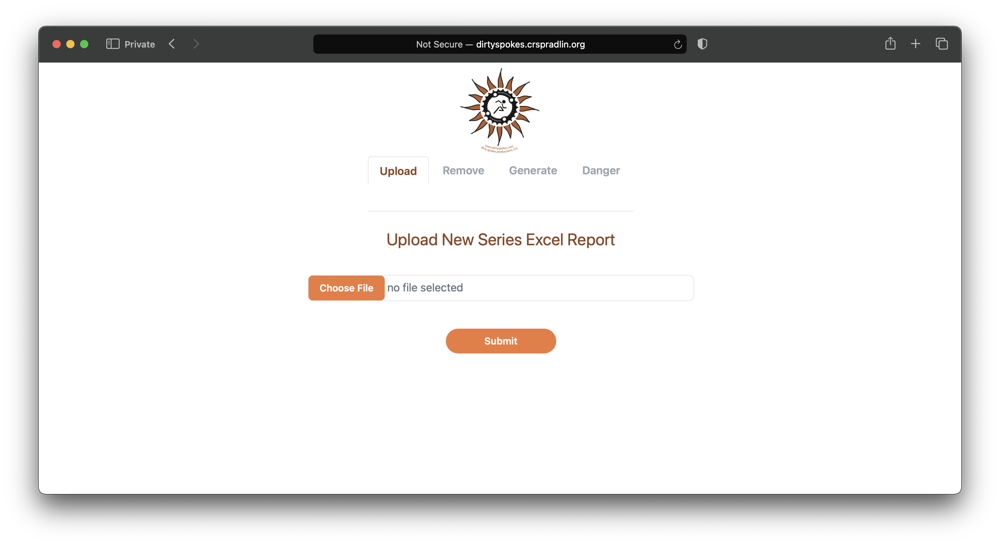
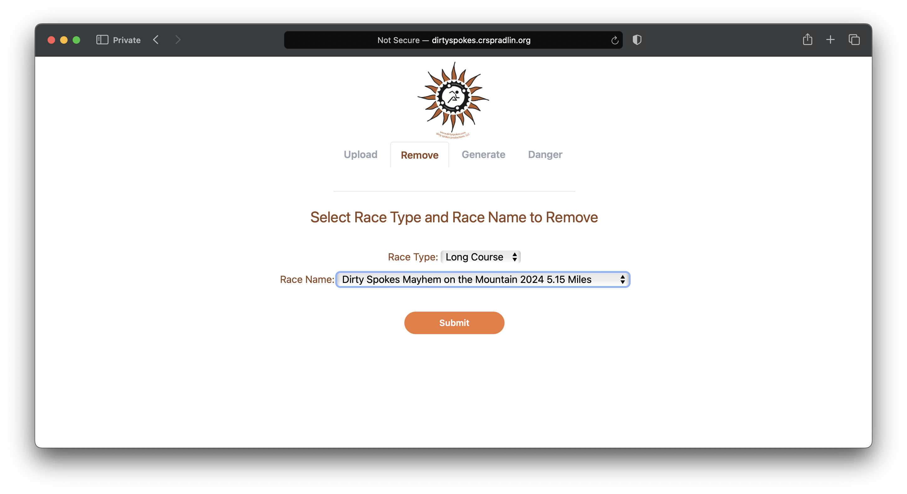
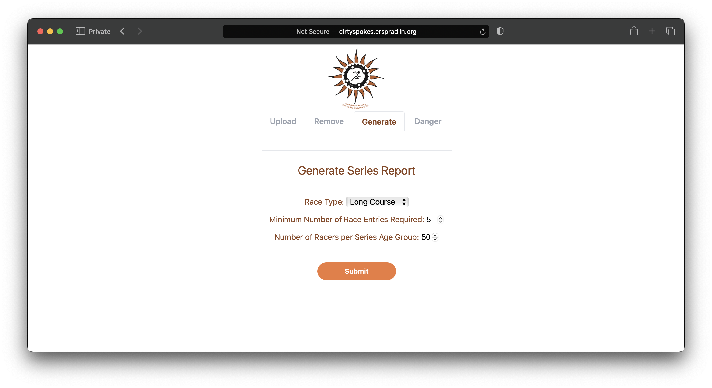
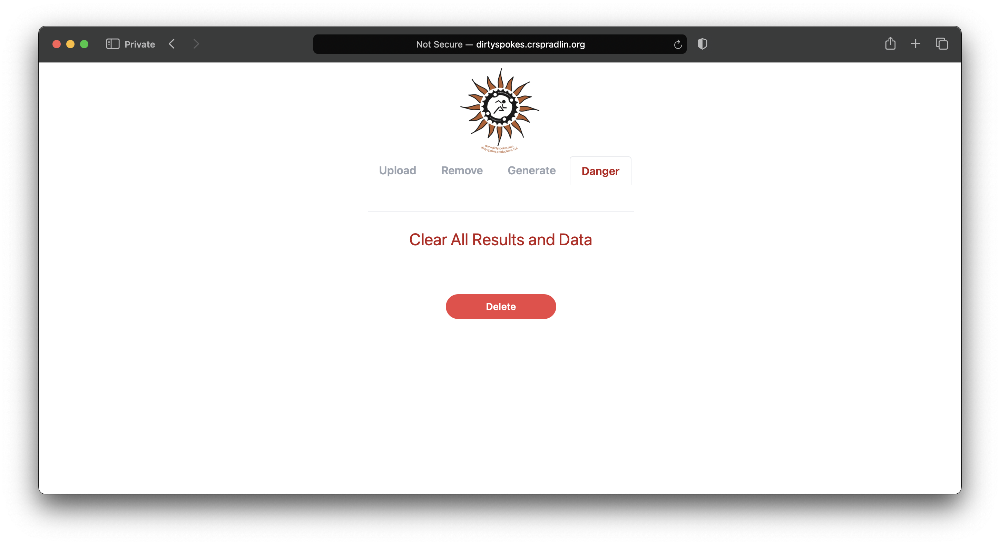

# DirtySpokesSeriesApp
This app is the source code for a project dedicated to automating series winner determination of the North Georgia Dirty Spokes trail races. Check out their [running trail races and MTB racing](http://www.dirtyspokes.com)!

Access to this deployed application is only allowed for certain race maintainers. If you have any additional questions, or want help in deploying a similar application, please feel free to reach out to me directly at [support@crspradlin.org](mailto:support@crspradlin.org)

## Report Uploads

The application allows for direct excel document uploads. The content of these uploaded files are processed and recorded on a Google SpreadSheet, which acts as a kind of database.

## Report Removals

At times the contents of previously uploaded files can be removed dynamically to either allow for re-uploads or just simple removals.

## Download Reports

Content that has been uploaded and processed can be recalled and downloaded back as an excel file to display the current race series standings.

## Danger Page

At the start of each series, the current data needs to be rmvoed to make way for the new race files and content to be uploaded. This danger form and button allow for this exact function. A start-from-scratch sort of function.

